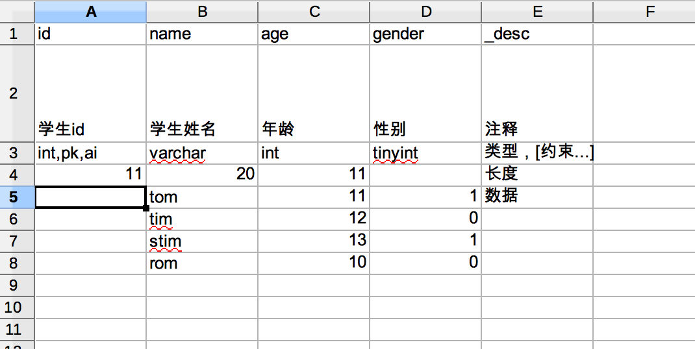
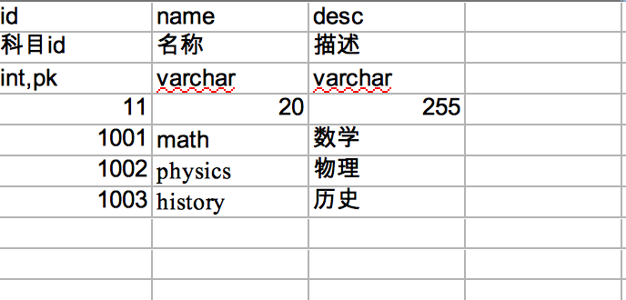

### Useage：

## Install

```
  npm install excel2mysql
```

## Use

just get sql:

```
var excel2mysql = require('excel2mysql');

var excelPath = "./sample.xls";

excel2mysql({
    input: excelPath,
    mode: 'create'
}, function (err, sql, result) {
    err && console.error(err);
    sql && console.log(sql.sql);
});

```

connect mysql:

```
var excel2mysql = require('excel2mysql');

excel2mysql({
    input: excelPath,
    mode: 'create',
    mysql: {
        host: '127.0.0.1',
        user: 'work',
        password: 'work',
        port: '3306',
        database: 'test'
    }
}, function (err, sql, result) {
    err && console.error(err);
    sql && console.log(sql.sql);
});

# or

excel2mysql({
    input: excelPath,
    mode: 'diff',
    mysql: {
        host: '127.0.0.1',
        user: 'work',
        password: 'work',
        port: '3306',
        database: 'test'
    }
}, function (err, sql, result) {
    err && console.error(err);
    result && result.type === "diff" && console.log("#diff#: ",JSON.stringify(result.data));
});

```

use `await`:

```
var excel2mysql = require("../");
var fs = require("fs");
var excelPath = "./sample.xls";

(async function(excelPath) {
  var start = new Date().getTime();
  await excel2mysql(
    {
      input: excelPath,
      mode: "create",
      mysql: {
        host: "127.0.0.1",
        user: "work",
        password: "work",
        port: "3306",
        database: "test"
      }
    },
    function(err, sql, result) {
      err && console.error(err);
      sql && console.log(sql.sql);
      // result && console.log(result);
    }
  );

  console.log(
    "end. use time: " + (new Date().getTime() - start) / 1000 + " s."
  );
})(excelPath);

```

### param

> Note: `model` is deprecated, please use `mode`

- mysql: config for mysql
- mode:

```
delete: just drop table
update: just add new table , and import data to a new table, if no config for mysql, the mode eqaul "create"
create: drop all table, then create tables and import data to tables
diff: compare excel and mysql , and you can get json data from "result"
```

- no_comment: true or false(default), if ture, threre is no comment for sql of creating tables
- ingnore_prefix: `-`(default), if the name field starts with that, it will be ignored

### excel fromat

config for table


config for create table and import data to table



data type(row:3):`[type],[pk,ai,nn,uq,(0)]...`

```
(0) = default 0
ai = auto_increment
nn = not null
uq = unique
pk = primary key

zf = zerofill (only use for number)
un = unsigned (only use for number)
bin = binary (only use for string)
```

if use `ai`, this col will be ignored



## Global Install

```
npm install excel2mysql -g
```

### Use as Command

```
excel2mysql -o ./db.sql -i ./sample/sample.xls -S 100

#or

excel2mysql -o ./db.sql -i ./sample/sample.xls -S 100 -uwork -pwork -dtest
```

### import config file

```
excel2mysql -c  ./sample/config.json -S 100

# or

excel2mysql -c  ./sample/default.config.js -S 100 -m diff

```

> Node: If a configuration file is used, the relative path will be based on the directory of the configuration file.
> Configuration file priority is higher than command assignment.

./sample/default.config.js:

```
module.exports = {
  input: "./sample.xls",
  // mode: "diff",
  output: "./",
  mysql: {
    host: "127.0.0.1",
    user: "work",
    password: "work",
    port: "3306",
    database: "test"
  }
};
```

./sample/config.json:

```
{
  "input": "./sample.xls",
  "mode": "create",
  "output": "./",
  "mysql": {
    "host": "127.0.0.1",
    "user": "work",
    "password": "work",
    "port": "3306",
    "database": "test"
  }
}
```

### Compare excel and mysql

```
excel2mysql -m diff  -d test -i ./sample.xls -o ./db.json -S 100
```

\$TABLE_FILEDS: fields of table

key: table name/table field/fields of table

### Param

```
$: excel2mysql --help

Options:
  -i, --input=ARG          excel-file Path
  -o, --output=ARG         sql-file path or json-file path
      --no-comment         no comment for table and columns in sql
      --show-sql           print sql to console
  -S                       a number, print sql to console, and the string.length <= this number
      --ingnore-prefix=ARG if the name field starts with that, it will be ignored
      --help               show Help
  -v, --version            show version
  -m, --mode=ARG           mode: create(default), delete, update, diff
  -P, --port=ARG           mysql:port default: 3306
  -h, --host=ARG           mysql:host default: 127.0.0.1
  -p, --password=ARG       mysql:password default: root
  -u, --user=ARG           mysql:username default: root
  -d, --database=ARG       mysql:database
  -c, --config=ARG         defualt: default.config.js
```

---

[简书地址](https://www.jianshu.com/p/b1c4496638a2)

[github 地址](https://github.com/xiaoyifan6/excel2mysql)
